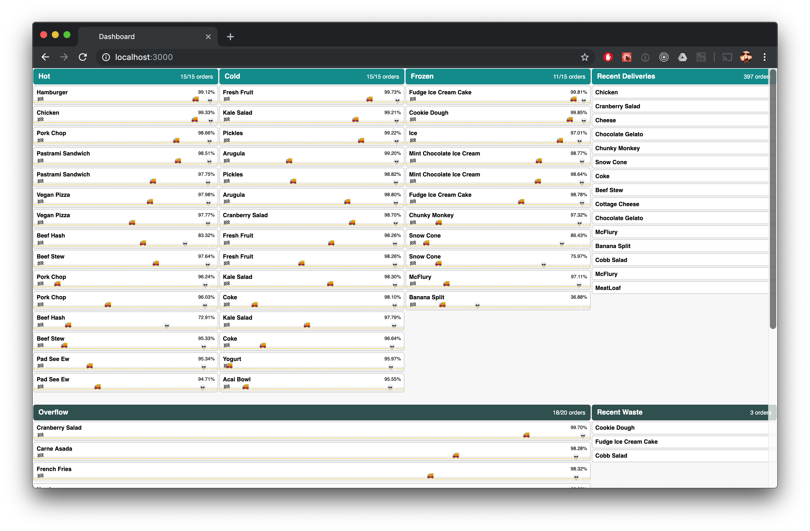
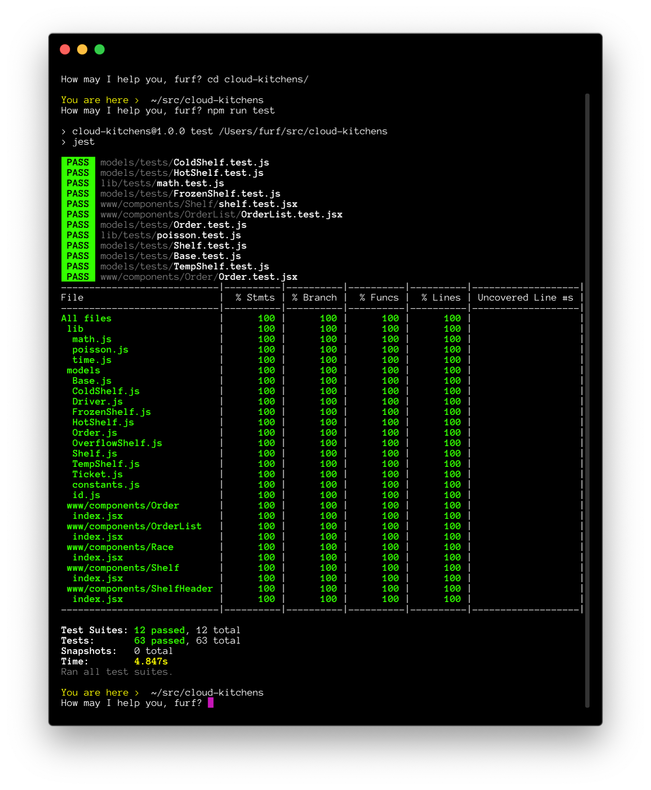

# New Coding Test

Prepared by [David Furfero](mailto:furf@furf.com).



<center><small><i>Dashboard for monitoring order simulation.</i></small></center>

## Getting Started

Install the project dependencies.

```shell
$ cd new-coding-test
$ npm install
```

## Running the Demo

1. Start the API server. 

  ```shell
  $ npm run api
  ```

2. In a separate terminal session, start the web server.

  ```shell
  $ npm run www
  ```

3. Open a web browser and navigate to the Dashboard at http://localhost:3000.

4. To begin the ordering, open another browser and navigate to http://localhost:3000/orders. The orders will begin streaming immediately.

### Order More

To order more, reload the [orders web page](http://localhost:3000/orders) or open an additional window.

### Reset the Data

To clear the completed queue and all executing orders, stop and restart the API server.

## Running the Tests

All tests, including linting ([ESLint](https://eslint.org/) and [Prettier](https://prettier.io/)) will run before every commit using [husky](https://github.com/typicode/husky) for assigning npm scripts to Git hooks.

If you want to run the tests manually, you can do so via npm script.

```shell
$ npm run test
```

A coverage report is generated with each test. 

Test coverage is incomplete, but we're off to a good start.



<center><small><i></i>Jest test coverage report</i></small></center>

### Testing During Development

During development, you can have tests run whenever tests or covered code are updated using the `test:watch` command. (Only the necessary tests will run on update.)

```shell
$ npm run test:watch
```

#### Installing Watchman

To run `test:watch`, you will need to have [Watchman](https://facebook.github.io/watchman/) installed. (This will also require [brew](https://brew.sh/).)

```shell
$ brew update
$ brew install watchman
```

### Ensuring Code Quality and Consistency

We also use [ESLint](https://eslint.org/) to ensure code quality and [Prettier](https://prettier.io/) to ensure consistent formatting. These tools are configured to run cooperatively and avoid overlapping checks. ESLint is configured to follow [Airbnb's popular JavaScript style guide](https://github.com/airbnb/javascript).

You can lint the code base manually using the `lint` command.

```shell
$ npm run lint
```

You can quickly fix simple lint errors using the `lint:fix` command.

```shell
$ npm run lint:fix
```

## Generating Documentation

The project is documented using JSDoc. Documentation is generated using the pre-commit Git hook, and it can be generated manually using the `docs` command.

```shell
$ npm run docs
```

You can also preview the documentation using the `docs:read` command. This command will generate the documents, start an HTTP server, and open your web browser to http://localhost:3001.

```shell
$ npm run docs:read
```

## About the Code

### Servers

The project consists of two servers: an Apollo GraphQL API server and a Next.js web server.

The API code is written in Node.js. The web server is written in React, React Apollo (data) and Less (CSS).

The [Dashboard](http://localhost:3000) updates in real-time via GraphQL subscriptions to the server. The [Orders page](http://localhost:3000/orders) posts orders to the API via GraphQL mutations.

The server operates an in-memory cache of all orders. (If I have time in the next few hours, I will finish the persistent store (MySQL) capability. The data hydration on server restart will just have to wait for another time.)

The entire project, including the persistent store, is capable of being run in a serverless environment (AWS, Now, etc.).

### Shelf Life Derivation

Every time an order is moved to a shelf, a ticket is created containing a reference to the shelf and a time stamp. This allows us to accurately track decay as an order moves between shelves of differing decay factors.

```js
get shelfLife() {
  // Compute the order's current shelf life by iterating through its history
  // and reducing the accumulated shelf life by the decay incurred on each
  // shelf.
  const shelfLife = this.tickets_.reduce((shelfLife, ticket, index, tickets) => {
    // Calculate ticket age by comparing its timestamp to the next ticket.
    const next = tickets[index + 1];
    const endedAt = next ? next.createdAt : now();
    const age = endedAt - ticket.createdAt;

    // Decay rate is the product of the order's decay rate and the shelf's
    // decay factor.
    const decayRate = this.decayRate * ticket.shelf.decayFactor;

    // Decay and remaining shelf life are derived using the following
    // provided formula:
    // value = (shelfLife - orderAge) - (decayRate * orderAge)
    // Which can be simplified to:
    // value = shelfLife - ((decayRate + 1) * orderAge)
    const decay = (decayRate + 1) * age;
    return shelfLife - decay;
  }, this.shelfLife_);
  return Math.max(0, shelfLife);
}
```

### Order Prioritization

With each expedite call, all healthy orders are prioritized for shelf placement by the likelihood that they will expire before their driver arrives. At-risk orders are given higher priority and placement on the Hot, Cold, and Frozen shelves.

The following algorithm favors orders nearing expiration and/or having slower drivers:

_/models/Order.js_

```js
get priority() {
  const timeToLive = this.shelfLife / (this.decayRate + 1);
  const driverMargin = timeToLive - this.driver.timeToArrival;
  const priority = timeToLive * driverMargin;
  return priority;
}
```

Orders with negative `driverMargin` (and therefore negative `priority`) are discarded, even if they are healthy (shelf life > 0), because they will expire before their driver arrives. (It does not make sense to occupy shelf space with orders that will not be successfully delivered.)

_/models/Expeditor.js_

```js
// Map objects to cache the computed `priority` property before sorting in
// order to minimize the O-complexity to O(n).
const priorities = this.orders.map(order => {
  return {
    priority: order.priority,
    order,
  };
}).sort((a, b) => a.priority - b.priority);
```

Once prioritized, each order is placed on the most favorable shelf. Shelves validate orders and return false if an order is invalid. They are also aware of their available capacity and will return false if at capacity.

```js
get availableCapacity() {
  return this.capacity - this.orders.length;
}

get hasAvailability() {
  return this.availableCapacity > 0;
}

isValidOrder({ priority }) {
  return priority > 0;
}

add(order) {
  if (!this.hasAvailability || !this.isValidOrder(order)) {
    return null;
  }
  order.shelf = this;
  this.orders.push(order);
  return order;
}
```

> Note: I'm aware of the potential memory leak due to the two-way binding above. It will be remedied when the MySQL support is added and expired orders are purged from the in-memory cache.

The "Delivery Window" and "Waste Bin" are treated as shelves, allowing the following cascade to handle all order placement:

_/models/Expeditor.js_

```js
const orders = priorities.map(({ order }) =>
  this.shelves[DELIVERY].add(order) ||
  this.shelves[order.temp].add(order) ||
  this.shelves[OVERFLOW].add(order) ||
  this.shelves[WASTE].add(order)
);
```

### Poisson Randomizer

The orders are placed at 1-second intervals using a custom random number generator which returns a number of orders based on its probability within a Poisson distribution of a given lambda.

The randomizer is built by generating an array of Poisson probabilities whose indexes are the respective number of events. These probabilities, which sum to 1, are mapped to an array of cumulative sums.

```js
getCumulativeSums([0.1, 0.3, 0.4, 0.2]) // [0.1, 0.4, 0.8, 1.0]
```

This gives us proportional distribution within a range of 0–1 which can be iterated and compared to a random number, also 0–1, to determine with accurate probability the number of events (the array index) to trigger each second.

### Model Class Hierarchy

- `Base`
  - `Shelf`
    - `TempShelf`
      - `ColdShelf`
      - `FrozenShelf`
      - `HotShelf`
      - `OverflowShelf`
    - `WasteBin`
    - `Driver`
  - `Expeditor`
  - `Order`
  - `Ticket`

## If I Had More Time

* More documentation! More tests! I have tried to give a decent indication of how I document and test my work, however time limitations prevent me from providing complete coverage.
* Rewrite the entire project in TypeScript. Given my time constraints, I wrote in JS where I'm more nimble. Otherwise, I'm beginning to write all of my side projects in TS and it's been a game-changer.
* Complete the persistent data store that I started writing using Serverless MySQL. This provides monitoring and management of a large number of concurrent database connections.
* Abstract out the `Driver` class further to support a finite driver pool.

PS—The animations on the Dashboard only took about an hour and a half. They're not to blame!

